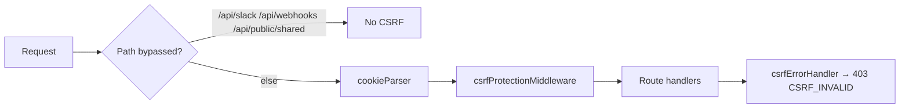

# Authentication Architecture (Current System)

> [!WARNING]
> **ARCHIVED / HISTORICAL DOCUMENTATION**  
> The Clerk authentication migration has been fully completed. Clerk is now the sole identity provider for MeetOnMemory.  
> For current contributor setup and development instructions, please refer to [AUTH_CONTRIBUTOR_RUNBOOK.md](../AUTH_CONTRIBUTOR_RUNBOOK.md).

**Status:** Verified from MeetOnMemory source.  
**Last reviewed against:** repository `server/` and `client/src/` during Clerk migration planning.

If a claim cannot be confirmed from source, it is marked **Not verified from source.**

---

## 1. Overview

MeetOnMemory separates **identity** (who you are) from **authorization** (what you may do).

| Concern             | Owner       | Mechanism                                           |
| ------------------- | ----------- | --------------------------------------------------- |
| Identity / session  | Application | Email/password → JWT in cookie `token`              |
| Mutation CSRF       | Application | `csurf` cookie `_csrf` + header `X-CSRF-Token`      |
| Authorization       | Application | `req.user.role`, `req.user.organization`, `rbac.js` |
| Org membership data | MongoDB     | `Membership` (+ denormalized fields on `User`)      |

There is **no** Passport.js and **no** Google/GitHub **login**. Google OAuth in this repo is **calendar integration only**.

---

## 2. Login flow

```mermaid
sequenceDiagram
  participant B as Browser
  participant L as Login.jsx
  participant API as Express
  participant AS as AuthService
  DB as MongoDB

  B->>L: Open /login
  L->>API: GET /api/csrf-token (credentials)
  API-->>L: csrfToken + Set-Cookie _csrf
  B->>L: email + password
  L->>API: POST /api/auth/login + X-CSRF-Token
  API->>AS: login()
  AS->>DB: find user by normalized email
  AS->>AS: bcrypt.compare
  AS->>AS: jwt.sign({ id }, JWT_SECRET, 7d)
  API-->>L: Set-Cookie token + success
  L->>API: GET /api/auth/is-auth
  L->>API: GET /api/auth/user-data
  L->>B: /dashboard or /organizations
```

**Evidence:**

- `client/src/pages/Login.jsx` — CSRF then `authApi.login` / `register`, then `initializeAuth`
- `server/services/AuthService.js` — `login`, `jwt.sign({ id: user._id }, …, { expiresIn: "7d" })`
- `server/controllers/authControllers.js` — `res.cookie("token", token, { httpOnly, secure, sameSite, maxAge })`
- `client/src/context/AppContext.jsx` — `initializeAuth` → CSRF → `/api/auth/is-auth` → `/api/auth/user-data`

---

## 3. Signup flow

1. `POST /api/auth/register` (rate-limited: `registerLimiter`) with CSRF.
2. `AuthService.register` hashes password (`bcrypt` cost 10), creates user, signs JWT, sends welcome email (async, errors logged).
3. Cookie `token` set identically to login.
4. New users: `role: null`, `organization: null`, `hasCompletedOnboarding: false`, `isAccountVerified: false`.
5. Client navigates to onboarding org hub when `!hasCompletedOnboarding`.

**Evidence:** `AuthService.register`, `userModel.js` defaults, `ProtectedRoute.jsx` onboarding gates.

---

## 4. Logout

1. Client calls `POST /api/auth/logout` (CSRF required — auth routes are **not** CSRF-exempt).
2. Server `clearCookie("token", …)` with matching flags.
3. Client clears `userData` / `isLoggedin` and CSRF memory (`logoutUser` in AppContext).
4. **No server-side token blacklist.** Stolen JWTs remain valid until expiry.

**Evidence:** `authControllers.logout`, `AppContext.logoutUser`.  
**Note:** `Navbar.jsx` logout path may skip `csrfService.clearToken()` — verified inconsistency.

---

## 5. Cookies

| Name                  | Purpose                        | Flags (production)                           |
| --------------------- | ------------------------------ | -------------------------------------------- |
| `token`               | Session JWT                    | httpOnly, secure, sameSite=`none`, maxAge 7d |
| `_csrf`               | csurf secret                   | httpOnly, secure, sameSite=`none`            |
| `shared_access_token` | Shared-link access (not login) | httpOnly; 1h                                 |

**Domain:** not set (host default).  
**CORS:** `credentials: true`; allowed header `X-CSRF-Token` (`server/config/corsOptions.js`).

Client never sets `token`; it relies on `withCredentials: true` (`apiClient.js`).

---

## 6. CSRF lifecycle



- Token issue: `GET /api/csrf-token` → `{ csrfToken: req.csrfToken() }` (legacy).
- Client storage: **removed** after Clerk cutover (`csrfService.js` deleted in Issue #1139).
- Mutating API calls now authenticate with Clerk Bearer tokens via `apiClient`; there is no client CSRF refresh/retry path.

**Evidence (current):** `client/src/services/apiClient.js` (Clerk Bearer). Historical server CSRF pieces may still appear in older migration notes.

---

## 7. JWT lifecycle

| Property   | Value                                                      |
| ---------- | ---------------------------------------------------------- |
| Payload    | `{ id: user._id }` only                                    |
| Secret     | `process.env.JWT_SECRET` (fatal if missing in `server.js`) |
| Expiry     | `7d`                                                       |
| Transport  | Cookie `token` **or** `Authorization: Bearer`              |
| Refresh    | **None** — no refresh endpoint or refresh-token collection |
| Revocation | Cookie clear only                                          |

**Verification:** `server/middleware/userAuth.js` → `jwt.verify` → `userModel.findById(decoded.id).select("-password")` → `req.user`.

### Secondary JWTs (not login sessions)

| Use               | Location                                 | Payload / TTL               |
| ----------------- | ---------------------------------------- | --------------------------- |
| Shared links      | `sharedLinkController.js`                | `{ linkId, hash }`, 1h      |
| Export download   | `exportDataJob.js` / user download route | `{ userId, fileName }`, 24h |
| Slack OAuth state | `slackController.js`                     | `{ orgId, userId }`, 15m    |

These share `JWT_SECRET` but must **not** be removed as “auth cleanup.”

---

## 8. Middleware chain (HTTP)

Typical protected route:

```text
cors → express.json →
  [bypass mounts: slack, webhooks, public shared] →
  cookieParser → csrf → global rate limiter →
  router: userAuth → RBAC helpers → controller
```

**Evidence:** `configureExpress` in `server/config/express.js`; route files under `server/routes/`.

---

## 9. Sockets

Three modules register JWT cookie auth:

| Module                         | Path                                |
| ------------------------------ | ----------------------------------- |
| Meetings / notifications rooms | `server/socket/meetingSocket.js`    |
| Live transcript                | `server/socket/transcriptSocket.js` |
| Collaborative docs `/sync`     | `server/socket/documentSync.js`     |

Pattern: parse `Cookie` → `token` → `jwt.verify` → `socket.userId` (+ role/org where implemented).

**Client gap (verified):** `client/src/hooks/useWebRTC.js` does **not** set `withCredentials: true`, while socket auth requires the cookie. Other clients (e.g. collaborative doc / transcript panels) do pass credentials.

---

## 10. RBAC

**Source of truth for API checks:** `req.user.role` and `req.user.organization` after `userAuth`.

**Permission matrix:** `server/utils/rbacPermissions.js`  
**Middleware:** `server/middleware/rbac.js` (`requirePermission`, `requireOrgMembership`, `requireOrgAccess`, `requireOwnerOrAdmin`, …).

**Roles on User:** `owner | admin | moderator | member | guest` (or `null` pre-onboarding).

**Membership model roles:** `admin | member` only (`membershipModel.js`).  
Team/org services sync membership into `User.role` / `User.organization`. RBAC does **not** query Membership on each request.

---

## 11. Organization authorization & onboarding

1. After signup, `ProtectedRoute` forces `/organizations` until `hasCompletedOnboarding`.
2. Create/join/select org updates user + Membership (`OrganizationService`).
3. Invitations are **email-keyed** (`invitationModel`), accepted while authenticated.
4. `GET /api/invitation/:token` is public (preview).

Frontend: `OrganizationHub`, `CreateOrganizationPage`, `JoinOrganizationPage`, invite accept via `?token=`.

---

## 12. OAuth

| Kind             | Present? | Notes                                                          |
| ---------------- | -------- | -------------------------------------------------------------- |
| Google login     | **No**   | Not verified as implemented; Login page has no Google button   |
| GitHub login     | **No**   |                                                                |
| Google Calendar  | **Yes**  | `/api/auth/google-calendar` + `/api/calendar/google/*`         |
| Outlook calendar | **Yes**  | via `calendarRoutes`                                           |
| Slack install    | **Yes**  | `userAuth` on install; JWT `state`; events via Slack signature |

### Parallel calendar token stores (verified)

1. `User.googleAccessToken` / `googleRefreshToken` via `AuthService.googleCalendarCallback`
2. Encrypted `CalendarIntegration` via `calendarRoutes` + `calendarSyncService`
3. `CalendarConnection` model + `calendarService` / jobs; `calendarController.js` appears **unmounted** by routes

---

## 13. Email verification & password reset

| Flow            | Auth required?   | Storage                              | Expiry |
| --------------- | ---------------- | ------------------------------------ | ------ |
| Send verify OTP | Yes (`userAuth`) | `verifyOtp`                          | 24h    |
| Verify email    | Yes              | clears OTP, sets `isAccountVerified` |        |
| Send reset OTP  | No               | `resetOtp`                           | 15m    |
| Reset password  | No               | bcrypt new password                  |        |

Frontend: `/email-verify`, `/reset-password`.  
**Gap:** `authApi.sendVerifyOtp` exists; primary UI navigation to send OTP is weak/missing.

---

## 14. Frontend auth surface

| Piece   | Path                                                                                                                                                                      |
| ------- | ------------------------------------------------------------------------------------------------------------------------------------------------------------------------- |
| Context | `AppContext.jsx` / `AppContent.js` (not AuthContext)                                                                                                                      |
| Guard   | `ProtectedRoute.jsx`                                                                                                                                                      |
| API     | **Current:** `apiClient.js` (Clerk Bearer). **Legacy:** `authApi.js` (`/api/auth/*` identity helpers; do not use for new work). CSRF client helper removed (Issue #1139). |
| Pages   | `Login.jsx`, `EmailVerify.jsx`, `ResetPassword.jsx`                                                                                                                       |

**Legacy inconsistency:** some pages read `localStorage.token` or parse `document.cookie` for Bearer headers; AppContext **does not** set `localStorage.token`.

---

## 15. User schema (auth-related fields)

From `server/models/userModel.js`:

- Identity: `name`, `email` (unique), `password` (**required**)
- Verify: `verifyOtp`, `verifyOtpExpireAt`, `isAccountVerified`
- Reset: `resetOtp`, `resetOtpExpireAt`
- Authz/onboarding: `role`, `organization`, `hasCompletedOnboarding`
- Calendar: `googleAccessToken`, `googleRefreshToken`, `calendarSyncEnabled`
- Profile: `profilePic`, `bio`, `dashboardPreferences`, `lastExportRequestedAt`

**No** Clerk fields, OAuth provider subject IDs, or refresh-token session collection.

---

## 16. Known verified defects (pre-migration)

| Issue                                                      | Evidence                                                                   |
| ---------------------------------------------------------- | -------------------------------------------------------------------------- |
| `req.user.currentOrganization` used in activity controller | `activityController.js` — field **not** on User schema (`organization` is) |
| WebRTC socket likely missing credentials                   | `useWebRTC.js` vs cookie JWT socket auth                                   |
| Calendar OAuth callback trust of `state` as userId         | `calendarRoutes` callbacks without `userAuth`                              |
| Triple calendar token stores                               | User / CalendarIntegration / CalendarConnection                            |

These are **not** fixed by Clerk alone; track in risks / later phases.
