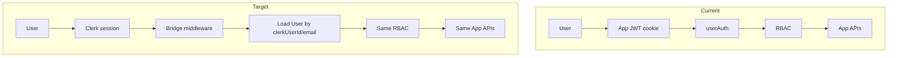

# Clerk Migration Proposal

## 1. Why migrate

MeetOnMemory’s identity layer is entirely custom: password hashing, OTP email verification/reset, JWT issuance, cookie session, and CSRF. That surface area is large relative to product features (meetings, AI, orgs) and competes with contributor bandwidth on security-sensitive code.

Target: **Clerk as Identity Provider only**. MongoDB remains the system of record for users’ application profile, organizations, memberships, and RBAC.

---

## 2. Current pain points (verified)

| Pain                                 | Evidence                                                             |
| ------------------------------------ | -------------------------------------------------------------------- |
| No session refresh / revocation list | JWT 7d; logout only clears cookie (`AuthService`, `authControllers`) |
| Custom OTP verify/reset              | User OTP fields + nodemailer templates                               |
| Global CSRF complexity               | `csurf` + client interceptor; auth POSTs require CSRF                |
| Dual client auth styles              | `apiClient` cookies vs legacy `localStorage.token` Bearer            |
| Verbose auth logging                 | `userAuth.js` logs cookies/Authorization                             |
| Security ops burden                  | `JWT_SECRET` lifecycle, cookie flags, CSRF regressions               |
| Missing social **login**             | Product/docs may imply Google login; only calendar OAuth exists      |

---

## 3. Expected improvements

- Hosted login, signup, email verification, password reset, MFA-ready
- Google **and** GitHub **login** via Clerk (net-new vs today)
- Centralized session revocation in Clerk dashboard
- Smaller custom auth codebase after cutover
- Better contributor DX (less CSRF/JWT boilerplate for new features)

---

## 4. Non-goals

| Non-goal                                         | Reason                                                                           |
| ------------------------------------------------ | -------------------------------------------------------------------------------- |
| Moving Organizations into Clerk Organizations    | App RBAC (`moderator`, `guest`, permission matrix) is richer and already shipped |
| Replacing MongoDB User `_id` as FK               | Entire data model keys on Mongo ObjectIds                                        |
| Rewriting Meetings/AI/Policies                   | They only need a stable `req.user`                                               |
| Replacing Google **Calendar** OAuth with Clerk   | Calendar tokens are Google API credentials, not login                            |
| Removing shared-link / Slack state / export JWTs | Not login sessions                                                               |
| Big-bang rewrite of frontend in one PR           | Violates deployability rule                                                      |

---

## 5. Architecture comparison

| Layer      | Current                   | Target                                                                                  |
| ---------- | ------------------------- | --------------------------------------------------------------------------------------- |
| Identity   | App                       | Clerk                                                                                   |
| Session    | Cookie JWT                | Clerk session / Clerk JWT                                                               |
| CSRF       | Required for cookie POSTs | Remove only when cookie JWT gone and Clerk mode does not require equivalent protections |
| `req.user` | Mongo User                | Mongo User (unchanged shape for controllers)                                            |
| RBAC       | App                       | App                                                                                     |

---

## 6. Security comparison

| Topic           | Current             | Clerk target                                                                     |
| --------------- | ------------------- | -------------------------------------------------------------------------------- |
| Passwords       | bcrypt in Mongo     | Clerk-managed                                                                    |
| Session theft   | 7d JWT until expiry | Clerk revocation                                                                 |
| CSRF            | Explicit            | Depends on token transport; must not remove CSRF while legacy cookie JWT remains |
| OAuth login     | Absent              | Clerk-managed                                                                    |
| Account linking | N/A                 | **Highest new risk** — email ↔ Mongo user                                        |
| Attack surface  | Custom OTP/JWT/CSRF | IdP dependency + bridge bugs                                                     |

---

## 7. Developer experience

| Today                                                                 | After                                    |
| --------------------------------------------------------------------- | ---------------------------------------- |
| Contributors must understand CSRF + cookies for any mutating API test | Tests use Clerk test keys / dual harness |
| Auth bugs block product PRs                                           | Auth bugs mostly in Clerk + thin bridge  |
| Login UI custom                                                       | Clerk components / hosted                |

---

## 8. Performance impact

| Area              | Impact                                                                |
| ----------------- | --------------------------------------------------------------------- |
| Login latency     | Network hop to Clerk (acceptable)                                     |
| Every API request | JWKS verify + Mongo user load (similar to today: verify + `findById`) |
| CSRF round-trip   | Removable after cutover → fewer requests                              |
| Sockets           | Must pass Clerk token/session — design cost in Phase 5                |

**Not verified from source:** exact p95 delta — requires load testing in Phase 6+.

---

## 9. Rollback strategy (summary)

1. **Feature flag** `AUTH_PROVIDER=legacy|dual|clerk` (default `legacy` until cutover).
2. **Git tag** `v1.0.0-jwt-stable` redeploy.
3. Keep password/OTP fields until Phase 8 soak completes.
4. Dual-auth period must allow legacy cookie login for unmigrated users.

Details: `03_MIGRATION_STRATEGY.md`, `00_VERSION_FREEZE.md`.
