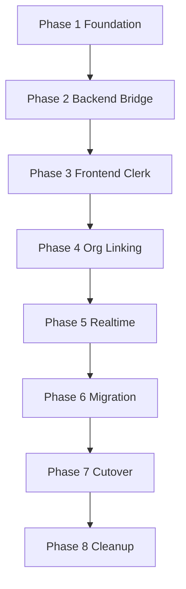

# Phases — Source of Truth

Do **not** start Phase N+1 until Phase N exit criteria are met and signed off.

Issue bodies for Phase 1 live in [`phase-1/ISSUES.md`](./phase-1/ISSUES.md).  
Later phases: issue bodies generated only when that phase is authorized.

---

## Phase 1 — Foundation

|                      |                                                                                                                                                            |
| -------------------- | ---------------------------------------------------------------------------------------------------------------------------------------------------------- |
| **Goal**             | Prepare repo for Clerk without changing runtime auth behavior                                                                                              |
| **Estimated issues** | ~10                                                                                                                                                        |
| **Dependencies**     | `v1.0.0-jwt-stable` tag                                                                                                                                    |
| **Exit criteria**    | `AUTH_PROVIDER` defaults to legacy; `clerkUserId` additive; ADR + inventory + threat model merged; app login/CSRF/sockets unchanged under legacy; CI green |

---

## Phase 2 — Backend Bridge

|                      |                                                                                                                                                                                                                            |
| -------------------- | -------------------------------------------------------------------------------------------------------------------------------------------------------------------------------------------------------------------------- |
| **Goal**             | Accept Clerk identity **and** legacy JWT; resolve Mongo `req.user`                                                                                                                                                         |
| **Estimated issues** | ~9–10                                                                                                                                                                                                                      |
| **Dependencies**     | Phase 1 complete                                                                                                                                                                                                           |
| **Exit criteria**    | Dual `userAuth` behind flag; `GET /api/me` (or equivalent) works with Clerk token in dual mode; legacy cookie path unchanged; calendar routes not broken; webhook linking stub or implemented safely; tests for both modes |

---

## Phase 3 — Frontend Clerk

|                      |                                                                                                                                   |
| -------------------- | --------------------------------------------------------------------------------------------------------------------------------- |
| **Goal**             | Flagged users sign in via Clerk UI; AppContext dual bootstrap                                                                     |
| **Estimated issues** | ~9–10                                                                                                                             |
| **Dependencies**     | Phase 2 bridge                                                                                                                    |
| **Exit criteria**    | ClerkProvider + feature-flagged login; apiClient dual path; ProtectedRoute works; legacy login still default; no CSRF removal yet |

---

## Phase 4 — Organization & Identity Linking

|                      |                                                                                                                                                 |
| -------------------- | ----------------------------------------------------------------------------------------------------------------------------------------------- |
| **Goal**             | Onboarding, invites, join/select preserve Mongo user continuity for Clerk users                                                                 |
| **Estimated issues** | ~8–10                                                                                                                                           |
| **Dependencies**     | Phase 3                                                                                                                                         |
| **Exit criteria**    | Create/join/invite/accept work for Clerk-linked users; RBAC fields identical; email match rules documented and tested; **no org model rewrite** |

> Adjustment vs early drafts: this phase is **linking + flows**, not rebuilding Organizations.

---

## Phase 5 — Realtime & Integrations

|                      |                                                                                                                                                                                |
| -------------------- | ------------------------------------------------------------------------------------------------------------------------------------------------------------------------------ |
| **Goal**             | Sockets, calendar connect, Slack install, legacy Bearer pages work with Clerk sessions                                                                                         |
| **Estimated issues** | ~8–10                                                                                                                                                                          |
| **Dependencies**     | Phase 4                                                                                                                                                                        |
| **Exit criteria**    | meeting/transcript/documentSync auth via Clerk; WebRTC credentials fixed; calendar OAuth still Google API; notifications rooms work; export/shared-link JWTs regression-tested |

---

## Phase 6 — User Migration / Cohort Rollout

|                      |                                                                                                                                 |
| -------------------- | ------------------------------------------------------------------------------------------------------------------------------- |
| **Goal**             | Backfill Clerk users; canary → percentage rollout                                                                               |
| **Estimated issues** | ~8–10                                                                                                                           |
| **Dependencies**     | Phase 5                                                                                                                         |
| **Exit criteria**    | Backfill script dry-run + prod runbook; active cohort on Clerk; legacy login retained for remainder; metrics dashboards defined |

---

## Phase 7 — Cutover

|                      |                                                                                                                                                             |
| -------------------- | ----------------------------------------------------------------------------------------------------------------------------------------------------------- |
| **Goal**             | Production default Clerk-only identity                                                                                                                      |
| **Estimated issues** | ~8–10                                                                                                                                                       |
| **Dependencies**     | Phase 6 soak                                                                                                                                                |
| **Exit criteria**    | `AUTH_PROVIDER=clerk` default; legacy register/login disabled; app JWT cookie no longer issued; CSRF removed **only if** justified; 48–72h monitoring clean |

---

## Phase 8 — Cleanup

|                      |                                                                                                                       |
| -------------------- | --------------------------------------------------------------------------------------------------------------------- |
| **Goal**             | Delete obsolete identity code and fields after retention                                                              |
| **Estimated issues** | ~8–10                                                                                                                 |
| **Dependencies**     | Phase 7 soak                                                                                                          |
| **Exit criteria**    | Files in `06_FILES_TO_REMOVE.md` deleted; OTP/password fields dropped or archived; tests/docs updated; program closed |

---

## Phase dependency graph

